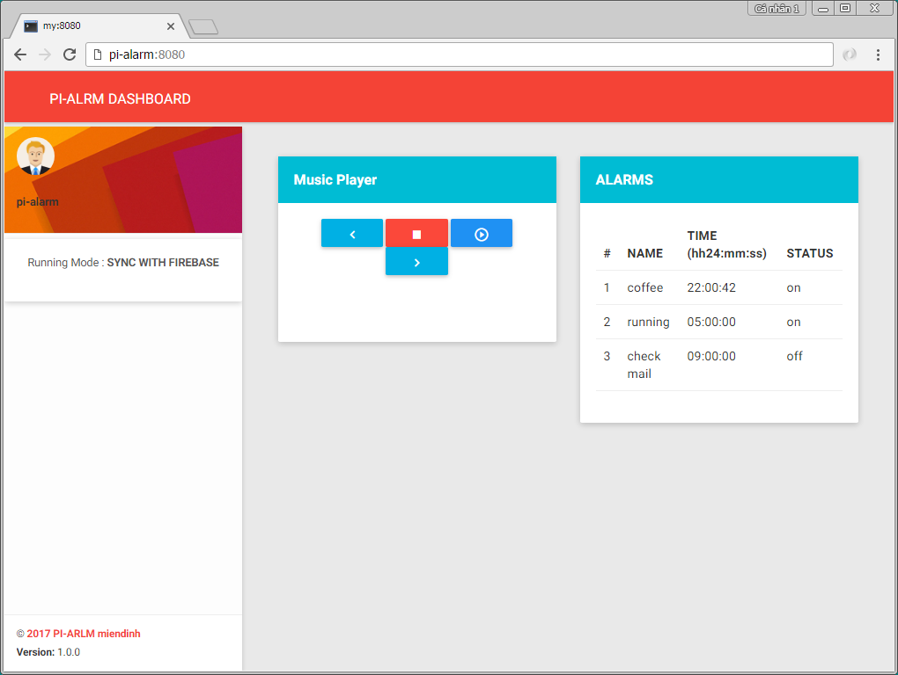

# Pi-Alarm
A tiny & cool application for Raspberry Pi 3 to alarm by playing music.
Pi-Alarm is controlled by [Hi-Morning](https://github.com/hi-morning/HiMorning) (a mobile app) that uses google firebase to sync scheduler alarms between Pi & mobile. [Hi-Morning](https://github.com/hi-morning/HiMorning) is contributed by **@thoqbk**



Special thanks to **@nghnam** [https://github.com/nghnam/music-aekt](https://github.com/nghnam/music-aekt) for supporting a nice and concise Python Mocp Wrapper Utils, which uses to play music in Linux Terminal Command Line.

# Requirements & Setup.
## Hardware
Pi - 3 with Wi-Fi & Audio support

## Setup Environment ( Ubuntu )
```
sudo pip install Flask
sudo pip install requests
sudo pip install python-firebase
sudo pip install apscheduler
sudo apt-get install moc
```

## Integrate with Hi-Morning
* You can use [Hi-Morning](https://github.com/hi-morning/HiMorning) as a mobile controller app. Let's follow introduction of **@thoqbk**

* Pi-Alarm can run standalone as well through browser.

## Update Pi-Alarm configuration
```
$ nano config.py
```

```
# flask server
DEBUG = True
HOST = "0.0.0.0"
PORT = 8080

# music folder
MUSIC_FOLDER = 'musics'

# running mode
## Note : unsupport Standalone mode yet !
STANDALONE = False

# firebase authentication
FIREBASE_URI = "https://pi-alrm.firebaseio.com"
FIREBASE_AUTH_USERNAME = "pi-alarm"
FIREBASE_AUTH_PASSWORD = "pi-alram"
.....
```

## Upload music 
* Download mp3 files to Pi and and put them into MUSIC_FOLDER

## Run
```
$ python app.py
```
Open browser and go to: http://your_pi_ip:8080

## Deploy with Gunicorn HTTP Server


#### Reference
1. http://apscheduler.readthedocs.io/en/3.0/userguide.html
2. https://moc.daper.net/